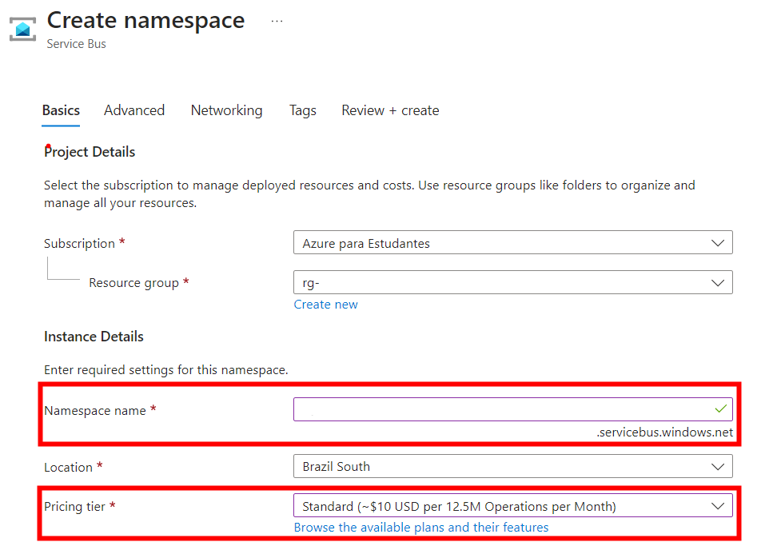
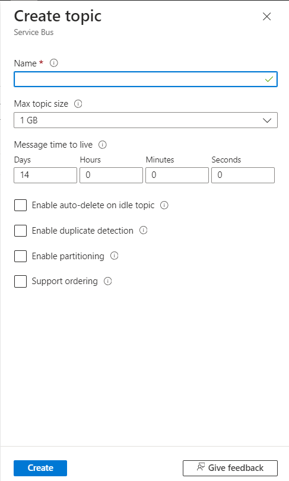

# tapr-2024-turmaa-colegio-nodejs

## Documentação do projeto
[Diagramas](https://univillebr-my.sharepoint.com/:u:/g/personal/walter_s_univille_br/EbLNg-hQDmdIjM6sIIFvjA0BHpsa_cRHPT0BpNIaea0yXw?e=tPsYS0)

## Extensões do VSCode
[JavaScript and TypeScript Nightly](https://marketplace.visualstudio.com/items?itemName=ms-vscode.vscode-typescript-next?wt.mc_id=AZ-MVP-5003638)

[Rest Client](https://marketplace.visualstudio.com/items?itemName=humao.rest-client?wt.mc_id=AZ-MVP-5003638)

## Criação do projeto
```
npm install -g yo generator-express-no-stress-typescript
yo express-no-stress-typescript
```
- Nome do projeto: microserv<nome do subdomínio>

1. Criar uma pasta com o nome de cada Bounded Context
2. Criar uma subpasta chamado entities e dentro dele criar as entidades
```
.
├── api
│   ├── controllers
│   │   └── examples
│   │       ├── controller.ts
│   │       └── router.ts
│   ├── middlewares
│   │   └── error.handler.ts
│   ├── secretaria
│   │   └── entities
│   │       └── aluno.ts
│   └── services
│       └── examples.service.ts
```

## Cosmos DB
[Introdução (https://learn.microsoft.com/en-us/azure/cosmos-db/introduction?wt.mc_id=AZ-MVP-5003638)](https://learn.microsoft.com/en-us/azure/cosmos-db/introduction?wt.mc_id=AZ-MVP-5003638)

[Databases, Containers e Itens (https://learn.microsoft.com/en-us/azure/cosmos-db/resource-model?wt.mc_id=AZ-MVP-5003638)](https://learn.microsoft.com/en-us/azure/cosmos-db/resource-model?wt.mc_id=AZ-MVP-5003638)

```
docker run \
    --publish 8081:8081 \
    --publish 10250-10255:10250-10255 \
    --name cosmosdb-linux-emulator \
    --detach \
    mcr.microsoft.com/cosmosdb/linux/azure-cosmos-emulator:latest    
```
### Instalação do certificado
```
curl --insecure https://localhost:8081/_explorer/emulator.pem > ~/emulatorcert.crt
```
```
sudo cp ~/emulatorcert.crt /usr/local/share/ca-certificates/
```
```
sudo update-ca-certificates
```
### IMPORTANTE: nas configurações do CodeSpace desabilitar a opção http.proxyStrictSSL

### Extensão do VSCode
[Azure Databases](https://marketplace.visualstudio.com/items?itemName=ms-azuretools.vscode-cosmosdb?wt.mc_id=AZ-MVP-5003638)
### Endpoint do simulador
```
AccountEndpoint=https://localhost:8081/;AccountKey=C2y6yDjf5/R+ob0N8A7Cgv30VRDJIWEHLM+4QDU5DE2nQ9nDuVTqobD4b8mGGyPMbIZnqyMsEcaGQy67XIw/Jw==;
```

### Modelagem de dados
[Modeling Data](https://learn.microsoft.com/en-us/azure/cosmos-db/nosql/modeling-data?wt.mc_id=AZ-MVP-5003638)

### Particionamento
[Partitioning](https://learn.microsoft.com/en-us/azure/cosmos-db/partitioning-overview?wt.mc_id=AZ-MVP-5003638)

### Instalar os módulos para conectar no CosmosDB

```
npm install @azure/cosmos
npm install @azure/identity
```

### Correções 04/11/2024
- Incluir as variáveis de ambiente dentro o arquivo .env na pasta microservcolegio
```
COSMOSDBURL=https://localhost:8081/
COSMOSDBKEY=C2y6yDjf5/R+ob0N8A7Cgv30VRDJIWEHLM+4QDU5DE2nQ9nDuVTqobD4b8mGGyPMbIZnqyMsEcaGQy67XIw/Jw==
COSMOSDBDB=dbcolegio
NODE_TLS_REJECT_UNAUTHORIZED = 0
```

## CRUD API REST
- [Documentação oficial da API do CosmosDB para JS](https://github.com/Azure/azure-sdk-for-js/tree/main/sdk/cosmosdb/cosmos#azure-cosmos-db-client-library-for-javascripttypescript)

### Verbo GET e POST
- Objetivo: Retornar uma lista de objetos ou um objeto específico a partir da chave, e salvar um novo aluno


#### api.yml
- Registrar os enpoints na documentação da API (dentro do item paths:)
```
  /alunos:
    get:
      responses:
        200:
          description: Returns all
          content: {}
    post:
      responses:
          200:
            description: Return all
            content: {} 
```


#### microservcolegio/server/api/secretaria/services/alunoservice.ts
```
import { Container, SqlQuerySpec } from "@azure/cosmos"
import cosmosDb from "../../../common/cosmosdb"
import { Aluno } from "../entities/aluno"


class AlunoService{
    private container:Container =
        cosmosDb.container("aluno")

    async all(): Promise<Aluno[]>{
        const {resources: listaAlunos}
            = await this.container.items.readAll<Aluno>().fetchAll()
        return Promise.resolve(listaAlunos)
    }
    async saveNew(aluno:Aluno): Promise<Aluno>{
        aluno.id = ""
        await this.container.items.create(aluno);

        return Promise.resolve(aluno);
    }
}


export default new AlunoService();
```

#### controllers/alunos/alunocontroller.ts
- Implememntar no controlador os métodos para buscar do banco todos os alunos e para salvar um novo aluno

```
import {Request, Response} from 'express';
import AlunoService from '../../secretaria/services/alunoservice';


class AlunoController{
    all(_:Request, res:Response): void{
        AlunoService.all().then((a) => res.json(a))
    }
    post(req:Request, res:Response): void{
        if(req.body == undefined)
            res.status(400).end()
        AlunoService.saveNew(req.body).then((a) => res.json(a))
    }
}

export default new AlunoController();
```
#### controllers/alunos/router.ts
- Registrar os endpoints no mecanismo de rotas

```
import express from 'express';
import controller from './alunocontroller';

export default express
    .Router()
    .get('/', controller.all)
    .post('/', controller.post)
```

### Registrar as rotas da API do Aluno no controlador de Rotas geral
```
import { Application } from 'express';
import examplesRouter from './api/controllers/examples/router';
import alunoRouter from './api/controllers/alunos/router'

export default function routes(app: Application): void {
  app.use('/api/v1/examples', examplesRouter);
  app.use('/api/v1/alunos', alunoRouter)
}
```

#### teste.rest
- Implementação do teste do verbo GET e POST
```
### Buscar todos os alunos
GET http://localhost:3000/api/v1/alunos

### Inserir um aluno
POST http://localhost:3000/api/v1/alunos
Content-Type: application/json

{
    "nome" : "zezinho"
}
```

## Excutar o projeto
```
npm run compile
npm start
```

# Azure Service Bus
- [Documentação](https://azure.microsoft.com/pt-br/products/service-bus)
- Passo 1: Criar uma instância do recurso Service Bus, informando o namespace name e o pricing tier Standard (a partir desse SKU há suporte a tópicos)

- Passo 2: Uma vez provisionado, clicar no menu tópicos

- Passo 3: Clicar no link para criar um novo tópico

- Passo 4: Informar o nome do tópico no padrão topico-NOMEDOMICROSERVICO-NOMEDAENTIDADE

- Passo 5: Uma vez que o tópico seja provisionado, clicar em subscriptions

- Passo 6: Clicar no link para criar uma nova subscription

- Passo 7: Informar o nome da assinatura no padrão subs-topico-NOMEDOMICROSERVICO-NOMEDAENTIDADE

- Passo 8: Clicar no ícone Service Bus Explorer para monitorar as mensagens


# Dapr
- Dapr é um runtime para construção, integração, execução e monitoramento de aplicações distribuídas no formato de microsserviços

- [Building blocks](https://docs.dapr.io/concepts/overview/#microservice-building-blocks-for-cloud-and-edge)

## Instalação
- [Instalação do Dapr CLI](https://docs.dapr.io/getting-started/install-dapr-cli/)

## Inicialização
```
cd microservcarro
dapr init
```

- Verificando a instalação
```
$ docker ps
CONTAINER ID   IMAGE                COMMAND                  CREATED          STATUS                    PORTS                                                                                                                                     NAMES
f377a492bae6   daprio/dapr:1.12.1   "./placement"            43 seconds ago   Up 42 seconds             0.0.0.0:50005->50005/tcp, :::50005->50005/tcp, 0.0.0.0:58080->8080/tcp, :::58080->8080/tcp, 0.0.0.0:59090->9090/tcp, :::59090->9090/tcp   dapr_placement
a5009c20daa7   redis:6              "docker-entrypoint.s…"   47 seconds ago   Up 44 seconds             0.0.0.0:6379->6379/tcp, :::6379->6379/tcp                                                                                                 dapr_redis
1d669098ac80   openzipkin/zipkin    "start-zipkin"           48 seconds ago   Up 44 seconds (healthy)   9410/tcp, 0.0.0.0:9411->9411/tcp, :::9411->9411/tcp                                                                                       dapr_zipkin
```

## Dependências no POM
- [SDK JavaScript](https://docs.dapr.io/developing-applications/sdks/js/)
```
    npm install --save @dapr/dapr
```
## Componentes Dapr
- Os componentes do Dapr são recursos utilizados pelos microsserviços que são acessados através do sidecar.
- [Dapr Components](https://docs.dapr.io/reference/components-reference/)
- Passo 1: criar uma pasta dentro de microservcarro -> components
- Passo 2: na pasta components criar o arquivo servicebus-pubsub.yaml

```
# Documentação: https://docs.dapr.io/reference/components-reference/supported-pubsub/setup-azure-servicebus/
apiVersion: dapr.io/v1alpha1
kind: Component
metadata:
  name: servicebus-pubsub
spec:
  type: pubsub.azure.servicebus.topics
  version: v1
  metadata:
  - name: namespaceName
    value: "ENDPOINT DO SERVICE BUS"
```

- Passo 3.1: na pasta do projeto executar o comando.

```
npm run compile
```

- Passo 3.2: na pasta principal do projeto (mesma pasta do arquivo package.json), criar um novo arquivo com o nome dapr.yaml
```
version: 1
common:
  resourcesPath: ./components/
apps:
  - appID: tapr-2024-NOMEDOMICROSERVICO-javascript
    appDirPath: .
    appPort: 3000
    command: ["npm", "run", "dev"]
```

## Publicação de atualizações da entidade principal do agregado

- Passo 4: alterar o arquivo .env para incluir dois novos parametros:
  - APPCOMPONENTTOPICCARRO=<nome do tópico registrado no service bus>
  - APPCOMPONENTSERVICE=servicebus-pubsub
```
#Exemplo
APPCOMPONENTTOPICCARRO=topico-<NOMEDOMICROSERVICO>-<NOMEDAENTIDADE>
APPCOMPONENTSERVICE=servicebus-pubsub
```
- Passo 5.1: na pasta common criar um arquivo daprclient.ts
```
import { DaprClient } from "@dapr/dapr";

const daprClient:DaprClient = new DaprClient({
        daprHost: process.env.DAPR_HOST as string,
        daprPort: process.env.DAPR_HTTP_PORT as string
});

export default daprClient;
```

- Passo 5.2:  na classe de serviço da entidade root do agregado, incluir os seguintes códigos:

```
//outros imports...
import { DaprClient } from "@dapr/dapr";
class CarroService{
    //muitas linhas de código...

    async publishEvent(carro:Carro): Promise<Carro>{
        daprClient.pubsub.publish(process.env.APPCOMPONENTSERVICE as string,
                                  process.env.APPCOMPONENTTOPICCARRO as string,
                                  carro);
        return Promise.resolve(carro);

    }
    async saveNew(carro:Carro): Promise<Carro>{
        carro.id = "";
        await this.container.items.create(carro);
        //chamar o método para publicar o evento de atualização da entidade
        await this.publishEvent(carro);
        return Promise.resolve(carro);
    }
    async update(id:string, carro:Carro): Promise<Carro>{
        const querySpec: SqlQuerySpec = {
            query: "SELECT * FROM Carro c WHERE c.id = @id",
            parameters: [
                {name: "@id", value: id}
            ]
            };
        const {resources: listaCarros}
            = await this.container.items.query(querySpec).fetchAll();
        const carroAntigo = listaCarros[0];
        
        if(carroAntigo == undefined){
            return Promise.reject();
        }

        //Atualizar os campos
        carroAntigo.placa = carro.placa;
        
        await this.container.items.upsert(carroAntigo);
        //chamar o método para publicar o evento de atualização da entidade
        await this.publishEvent(carroAntigo);

        return Promise.resolve(carroAntigo);
    }
```

## Executar o teste de publicação de eventos
```
#Executar esse comando dentro da pasta do projeto
dapr run -f .
```
- Passo 6: Usar o arquivo teste.rest para invocar a API REST nos métodos POST e PUT, verificar no Azure Service Bus se os eventos foram publicados no tópico.

## Assinatura das atualizações em um tópico
- Escolher uma das entidades externas aos agregados.

- Passo 1: alterar o arquivo server.ts para modificar a configuração do tipo de objeto suportado pela biblioteca do body parser

```
    app.use(bodyParser.json({ limit: process.env.REQUEST_LIMIT || '100kb',
                              type: 'application/*+json' }));
```

- Passo 2.1: criar na classe Controller da entidade externa ao agregado um novo end point chamado atualizar, que será automaticamente chamado pelo Dapr toda vez que um novo evento for publicado no Service Bus

```
    updateEvent(req:Request, res:Response): void{
        ClienteService.updateEvent(req.body.data).then((r) => res.json(r)).catch(() => res.status(404).end());
    }
```
- Passo 2.2: alterar o arquivo de rotas do controlador para registrar o novo endpoint
```
export default express
    .Router()
    .get('/', controller.all)
    .get('/:id', controller.getById)
    .post('/', controller.post)
    .put('/:id', controller.update)
    .delete('/:id', controller.delete)
    .post('/event', controller.updateEvent);
```
- Passo 2.3: alterar o arquivo api.yml para registrar a nova rota da API REST.
``` 
  /clientes/event:
    post:
      responses:
        200:
          description: Return all
          content: {}
```
- Passo 3: incluir na classe de implementação do serviço da entidade, o código do método abaixo para receber a entidade e atualizar no banco de dados local do serviço.

```
    async updateEvent(cliente:Cliente): Promise<Cliente>{
        await this.container.items.upsert(cliente);
        return Promise.resolve(cliente);
    }
```
- Passo 4: criar um novo arquivo dentro da pasta components chamado servicebus-subscription.yaml com o objetivo de registrar de forma declarativa a assinatura ao tópico do Service Bus
    - topic é o nome do tópico no Service Bus
    - routes -> default: é a URL da API REST que será executada
    - pubsubname é o nome do componente que conecta no Service Bus
    - scopes são o nome das aplicações envolvidas na assinatura
```
apiVersion: dapr.io/v2alpha1
kind: Subscription
metadata:
  name: subs-topico-<NOMEDOMICROSERVICO>-<NOMEDAENTIDADE>
spec:
  topic: topico-<NOMEDOMICROSERVICO>-<NOMEDAENTIDADE>
  routes:
    default: /api/v1/clientes/event
  pubsubname: servicebus-pubsub
scopes:
- tapr-2024-NOMEDOMICROSERVICO-javascript

```

## Executar o teste de assinatura dos eventos
```
#Executar esse comando dentro da pasta do projeto
dapr run -f .
```
- Mantendo a aplicação em execução, abrir um novo terminal e executar o exemplo do comando abaixo alterando os parametros para simular a publicação de um evento.

```
#Exemplo de publicação de atualização do evento
# dapr publish --publish-app-id <nome da aplicação no arquivo dapr.yaml> --pubsub <nome do componente do service bus no arquivo /componenets/servicebus-pubsub.yaml> --topic <nome do topico registrado no service bus> --data '<objeto JSON contendo os campos da entidade>'

dapr publish --publish-app-id tapr-2024-NOMEDOMICROSERVICO-javascript --pubsub servicebus-pubsub --topic topico-equipe-0-cliente --data '{"id": "123","nome": "Zezinho","endereco": "Rua lalala 100"}'
```

- Verificar no banco de dados se a entidade foi registrada.